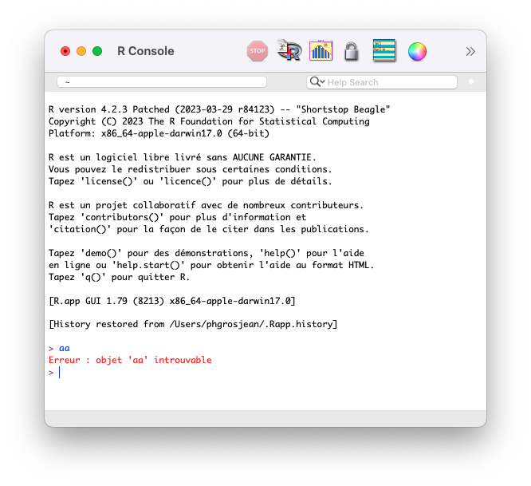
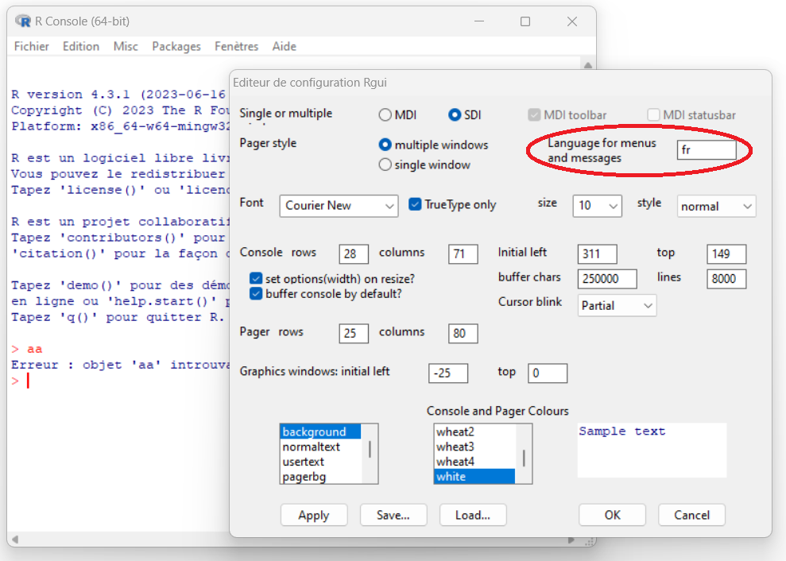
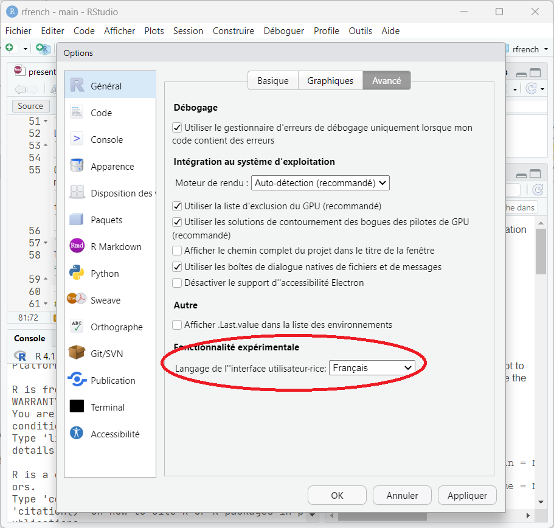
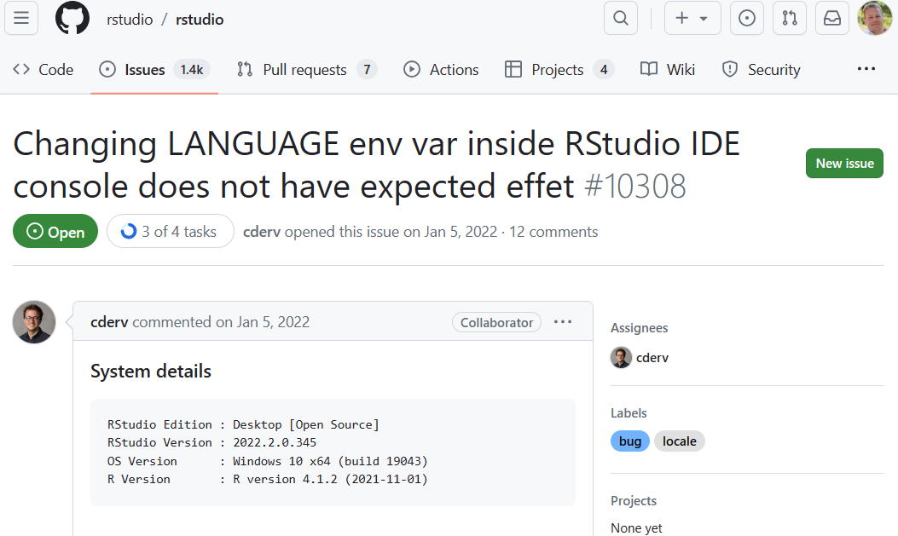
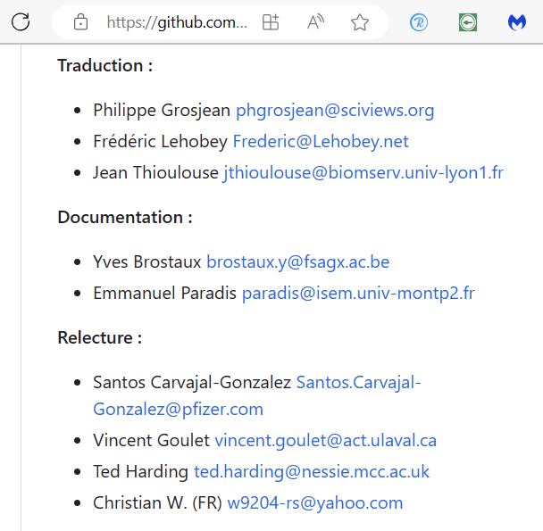

```{r setup, include=FALSE}
knitr::opts_chunk$set(echo = FALSE, warning = FALSE, message = FALSE)
#SciViews::R
```

------------------------------------------------------------------------

```{=tex}
\begin{center}
\Large \textbf{Qui sait que les messages de R peuvent être affichés en français ?}
\end{center}
```

------------------------------------------------------------------------

```{=tex}
\begin{center}
\Large \textbf{Qui n'utilise pas R en français ?}
\end{center}
```

------------------------------------------------------------------------

```{=tex}
\begin{center}
\Large \textbf{Qui utilise R en français ?}
\end{center}
```
### Pourquoi *ne pas* utiliser R en français ?

\alert{Si on est suffisamment bon en anglais...}

-   Messages originaux

\vfill

-   Pas de mélange de vocabulaire entre messages traduits et non traduits

\vfill

-   Plus facile parce que le message correspond à la doc (pages d'aide des fonctions)

\vfill

-   Plus facile pour échanger (questions / réponses sur des forums internationaux)

### Pourquoi utiliser R en français ?

-   Difficultés avec la langue de Shakespeare

\vfill

-   Moins intimidant pour un francophone peu habitué avec les termes en anglais

\vfill

-   Libère la barrière linguistique pour les débutants

\vfill

-   Obligatoire dans certains contextes (administrations Québécoises)

### Comment passer de l'anglais au français dans R ?

\alert{Cela dépend de l'OS.}

\vfill

\alert{Sous Linux} (et ailleurs), on pourra utiliser la variable d'environnement `LANGUAGE` :

``` bash
LANGUAGE=fr
```

Cette variable peut être indiquée dans `/etc/R/Renviron.site` une fois pour toutes ou on peut ajouter dans `Rprofile` :

```{r, eval=FALSE, echo=TRUE}
local({ Sys.setenv(LANGUAGE = "fr") })
```

### Comment passer de l'anglais au français dans R ?

\alert{Cela dépend de l'OS.}

\vfill

\alert{Sous MacOS}, on fera comme pour Linux ou on entrera dans le Terminal :

``` bash
defaults write org.R-project.R force.LANG fr_FR.UTF-8
```

... et pour revenir sur l'anglais :

``` bash
defaults write org.R-project.R force.LANG en_US.UTF-8
```

### R.app en français sous MacOS



### Comment passer de l'anglais au français dans R ?

\alert{Cela dépend de l'OS.}

\alert{Sous Windows}, on pourra l'indiquer dans les préférences de RGui.exe.



### Interface de RStudio en français

L'interface de RStudio peut maintenant aussi être basculée en français.



### Comment changer la langue en cours de session dans R ?

Versions récentes de R (\>= 4.2.0) =\> `Sys.setLanguage()`, versions plus anciennes =\> `Sys.setenv(LANGUAGE = 'fr')`.

```{r, echo=FALSE}
if (utils::compareVersion("4.2.0",
  paste(version$major, version$minor, sep = ".")) > 0) {
  Sys.setLanguage <- function(lang) {
    olang <- Sys.getenv("LANGUAGE")
    Sys.setenv(LANGUAGE = lang)
    invisible(olang)
  }
}
```

```{r, echo=TRUE, warning=TRUE}
olang <- Sys.setLanguage('fr') # Utiliser le français
1:2 + 1:3
Sys.setLanguage('en') # Passer à l'anglais
1:2 + 1:3
Sys.setLanguage(olang) # Rétablir la langue de départ
```

### Bug dans RStudio sous Windows

Les messages restent en anglais ! Ailleurs, cela fonctionne. Voir issue #10308 (<https://github.com/rstudio/rstudio/issues/10308>)



### Qu'est-ce qui est traduit ?

-   Traduction par packages (base + recommended + quelques autres).

-   Les messages `warning()` ou `stop()` automatiquement

-   D'autres chaînes de caractères avec `gettext()`/`ngettext()`

-   Installeurs et GUI Rgui.exe (Windows) et R.app (MacOS)

-   R Commander (<https://socialsciences.mcmaster.ca/jfox/Misc/Rcmdr/>)

\vfill

Voir <https://developer.r-project.org/Translations30.html>

\vfill

\alert{Cela représente plus de 10.000 messages traduits.}

### Qui traduit R ?

Une équipe de volontaires ; Philippe Grosjean fait l'interface avec le R Core team, voir <https://github.com/phgrosjean/rfrench>.

{width="60%"}

### Comment la traduction est-elle réalisée ?

Avec **poEdit**. La version Pro+ utilise **DeepL** pour des suggestions de traduction.


### Comment préparer mon package R à une traduction en français ?

-   Preparer les templates (fichiers .pot) avec `tools::update_pkg_po(pkgdir)`.

\vfill

-   Ouvrir poEdit, créer ou ouvrir le fichier de traduction .po pour le langage choisi.

\vfill

-   Mettre à jour avec le nouveau fichier template .pot

\vfill

-   Editer les (nouveaux) messages dans poEdit

\vfill

-   Recompiler le package R

### Comment traduire les jeux de données et les graphiques ?

Actuellement, il faut le faire manuellement, ... ou utiliser {data.io} et {chart} (pas encore sur CRAN, encore en phase exéprimentale):

\vfill

```{r, echo=TRUE, eval=FALSE}
remotes::install_github("SciViews/data.io")
remotes::install_github("SciViews/chart")
```

### Comment traduire les jeux de données et les graphiques ?

Avec le package {data.io}, un label est associé aux variables (auto ou avec `labelise()`.

```{r, echo=TRUE}
library(data.io)
urchin_en <- read("urchin_bio", package = "data.io")
urchin_en[1:3, 1:5]
label(urchin_en$origin)
```

### Comment traduire les jeux de données et les graphiques ?

Une version francisée est possible avec `lang = "fr"`, ou pour traduire également les niveaux de variables facteur `lang = "FR"` :

```{r, echo=TRUE}
urchin_fr <- read("urchin_bio", package = "data.io", lang = "FR")
urchin_fr[1:3, 1:5]
label(urchin_fr$origin)
```

### Utiliser chart() au lieu de ggplot() - version anglaise

```{r}
library(ggplot2)
library(chart)
```

```{r, echo=TRUE, out.width="70%"}
chart(aes(x = weight, y = skeleton, col = origin), data = urchin_en) +
  geom_point()
```

### Utiliser chart() au lieu de ggplot() - version française

```{r, echo=TRUE, out.width="70%"}
chart(aes(x = weight, y = skeleton, col = origin), data = urchin_fr) +
  geom_point()
```

### Comment fournir une aide aux fonctions en français aux débutants ?

-   Pas prévues pour être traduite dans R pour l'instant, mais...

\vfill

-   `svMisc::aka()` courtes pages d'aide alternatives style docstrings :

```{r, eval=FALSE, echo=TRUE}
remotes::install_github("SciViews/svMisc")
```

Créer une courte page d'aide :

```{r, echo=TRUE}
library(svMisc)
log <- aka(log, 
  description = "Logarithme d'un vecteur numérique (log en base e par défaut,\nou définir avec base=).",
  seealso = c("log10", "log1p", "exp","expm1"),
  example = c("log(5)", "# Log en base 3", "log(1:5, base = 3)"))
```

### Aide alternative avec `.?` de svMisc

Une fois {svMisc} chargé, on utilise `.?` à la place de `?` :

```{r, echo=TRUE}
.?log
```

L'example est exécuté en entrant `ex` à l'invite de R...

### Avez-vous des questions ?

```{=tex}
\begin{center}
\textbf{Ressources utiles}
\end{center}
```
\vfill

-   GitHub R french : <https://github.com/phgrosjean/rfrench>
-   data.io : <https://www.sciviews.org/data.io>
-   chart : <https://www.sciviews.org/chart/>
-   svMisc : <https://www.sciviews.org/svMisc/>
-   Cours : <https://wp.sciviews.org>

\vfill

```{=tex}
\begin{center}
\includegraphics[width=.16\textwidth,height=.2\textheight]{template/EcoNum-logo.pdf}  \includegraphics[width=.16\textwidth,height=.2\textheight]{template/SciViews-logo.pdf}
\end{center}
```
